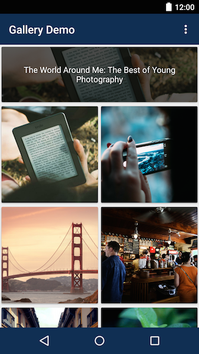
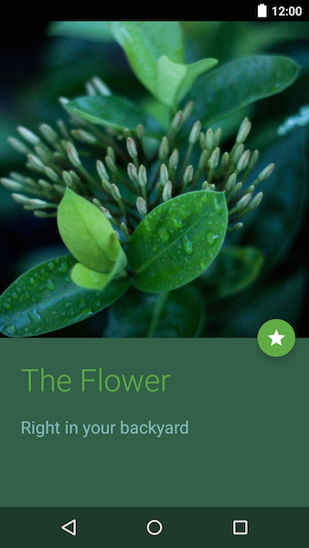

# Gallery Showcase

This is an Android application example for the [Contentful][1] gallery space template.

## Intro:

> [Contentful][1] is a content management platform for web applications, mobile apps and connected devices. It allows you to create, edit & manage content in the cloud and publish it anywhere via powerful API. Contentful offers tools for managing editorial teams and enabling cooperation between organizations.

## Screenshots

 

## Usage

- Create a space with the "Gallery" space template on [Contentful][1]
- Clone this repo
- Enter your Delivery API credentials in the [Const.java][const] file
- \o/

## License

Copyright (c) 2015 Contentful GmbH. See [LICENSE][2] for further details.

[1]: https://www.contentful.com
[2]: LICENSE
[const]: app/src/main/java/gallery/templates/contentful/lib/Const.java